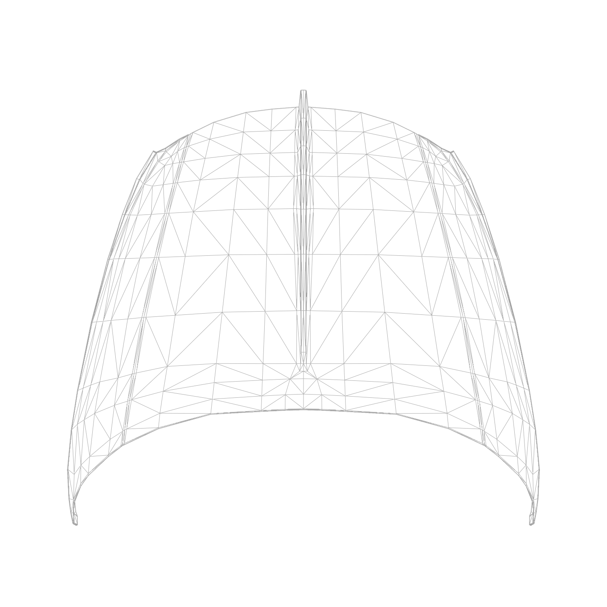
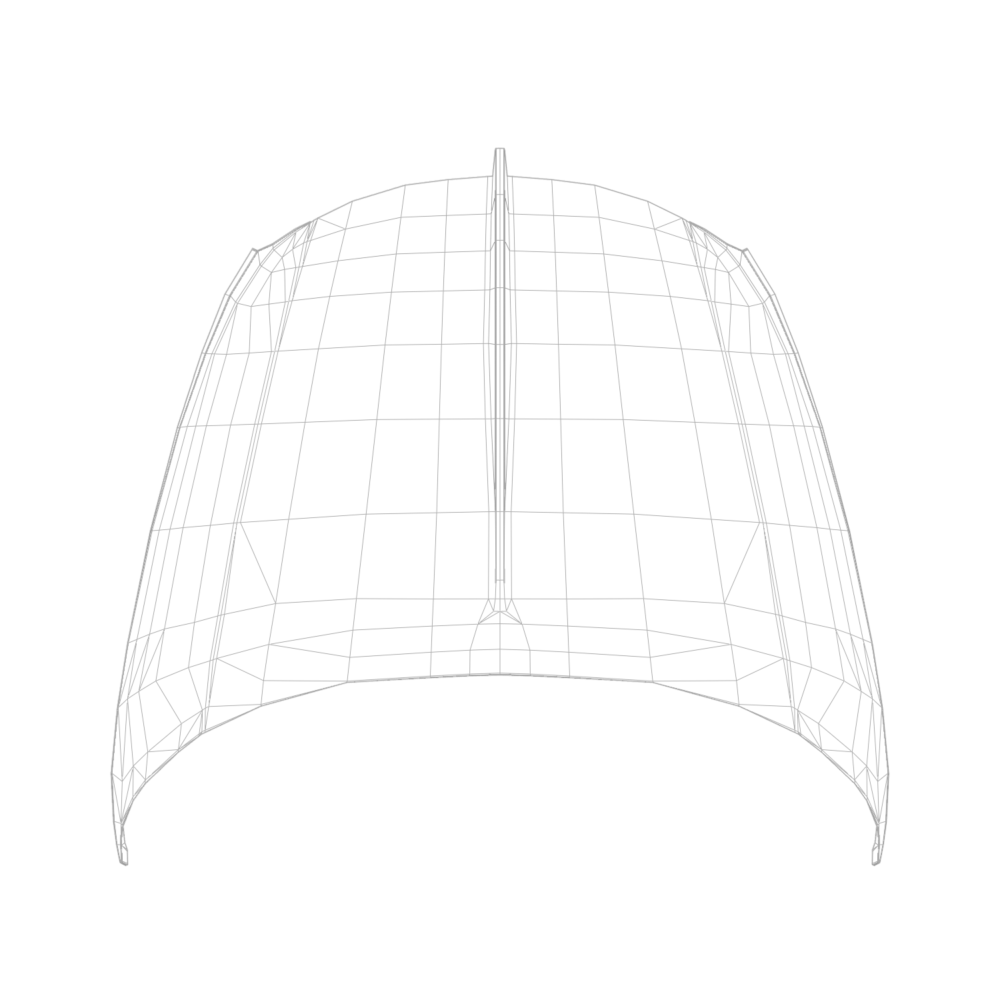
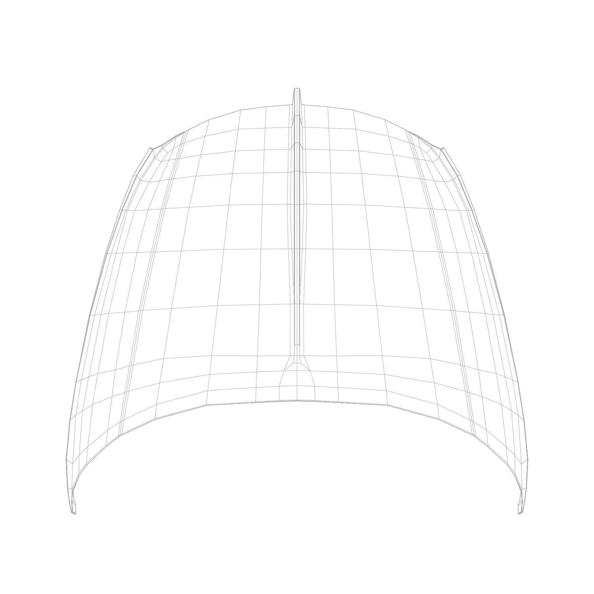

# Optimized Tris to Quads Converter

## Overview

**Optimized Tris to Quads Converter** is a Blender add-on that converts triangles (tris) in a mesh to quadrilaterals (quads) using mathematical optimization. This approach ensures the most optimal conversion of tris to quads, resulting in cleaner and more efficient mesh topology.

## Prerequisite

To use this add-on, you need to have the Pulp optimization library installed. The add-on provides an option to install Pulp directly from the preferences.

## Comparison of Topology

The images below compare the topology produced by Blender's default tris-to-quads conversion tool and the topology produced by the **Optimized Tris to Quads Converter**.

### Original Mesh with Tris

### Default Blender Tris to Quads

### Optimized Tris to Quads Converter

As illustrated in the comparison images, the optimized converter maintains better edge flow and reduces the number of unnecessary vertices, resulting in a more aesthetically pleasing and functional mesh.

## Features

- Converts selected tris in a mesh to quads using the Pulp optimization library.
- Ensures cleaner and more efficient mesh topology.
- Simple and user-friendly interface with an easy-to-use operator.

## Installation

1. Download the ZIP file containing the `__init__.py` script and other necessary files.
2. Open Blender and go to `Edit > Preferences > Add-ons`.
3. Click `Install` and select the downloaded ZIP file.
4. Enable the add-on from the list.

## Usage

### Installing Pulp

The add-on requires the Pulp optimization library. You can install it directly from the add-on preferences:

1. Go to `Edit > Preferences > Add-ons`.
2. Find the **Optimized Tris to Quads Converter** add-on in the list.
3. If Pulp is not already installed, click the `Install Pulp` button.
4. If Pulp is installed, it will display "Pulp is installed".

### Converting Tris to Quads

1. Enter `Edit Mode` and select the faces you want to convert.
2. In the 3D Viewport, go to `Face > Optimized Tris to Quads Converter`.
3. The selected tris will be converted to quads using mathematical optimization.

## Why Use This Add-on?

- **Optimization**: Uses advanced mathematical optimization to ensure the best possible conversion of tris to quads.
- **Clean Topology**: Results in cleaner and more efficient mesh topology, which is beneficial for modeling, animation, and simulation.
- **Ease of Use**: Simple interface integrated directly into Blender's editing workflow.

## Credits

- **Original Author**: Tsutomu Saito (https://github.com/SaitoTsutomu/Tris-Quads-Ex)
- **Improved Version**: Rulesobeyer (https://github.com/Rulesobeyer/)

### Acknowledgement to the Original Author

This add-on is based on the original work of Tsutomu Saito. In his article on Qiita, Tsutomu Saito describes the development process and the motivation behind the "Tris to Quads Ex" add-on for Blender. The article explains how the add-on uses the Pulp optimization library to convert tris to quads, ensuring a more efficient and cleaner mesh topology.

Tsutomu Saito's work focused on addressing the limitations of Blender's default tris-to-quads conversion tool. By leveraging mathematical optimization, the "Tris to Quads Ex" add-on produces superior results, making it an invaluable tool for Blender users aiming for high-quality 3D models.

The original article provides a detailed explanation of the methodology and implementation, including:
- The motivation for creating the add-on.
- The mathematical principles behind the optimization process.
- Step-by-step instructions on how to use the add-on.

Tsutomu Saito's innovative approach has significantly improved the tris-to-quads conversion process, and this improved version builds upon his foundation. We are grateful for his contributions to the Blender community.

[Read the original article on Qiita](https://qiita.com/SaitoTsutomu/items/b608c80d70a54718ec78).
